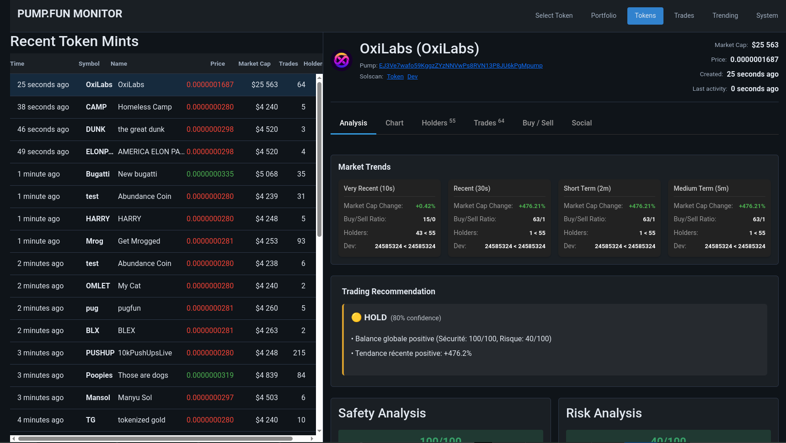
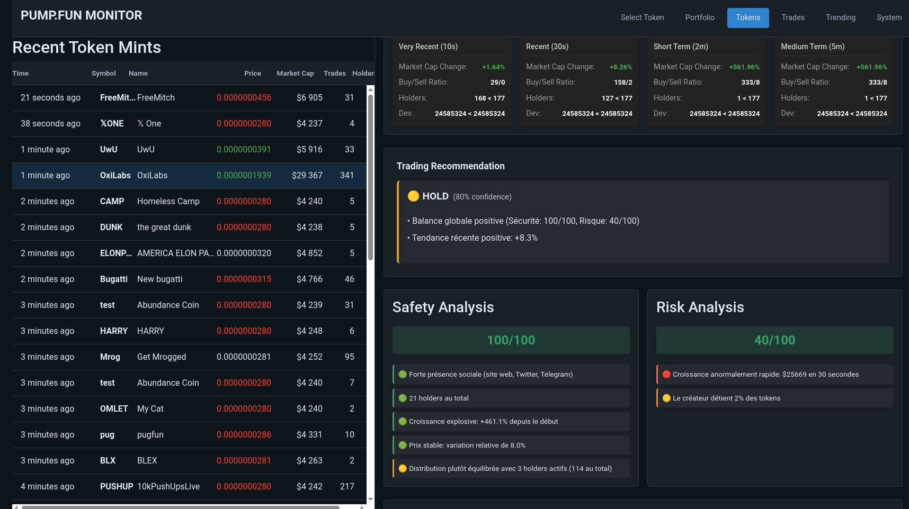
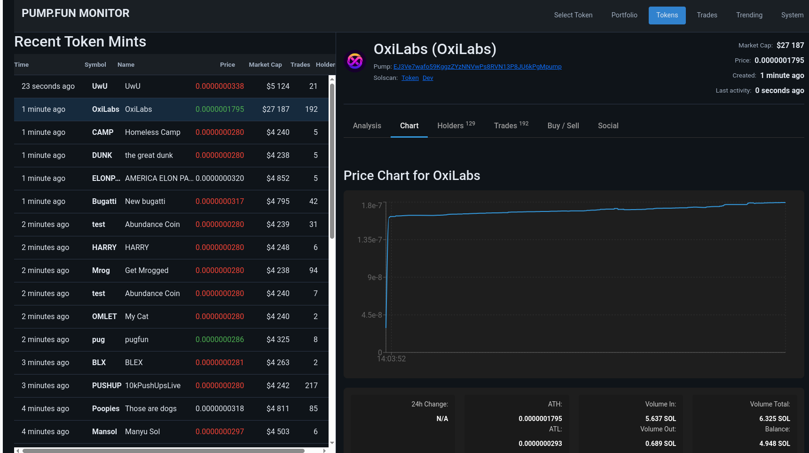
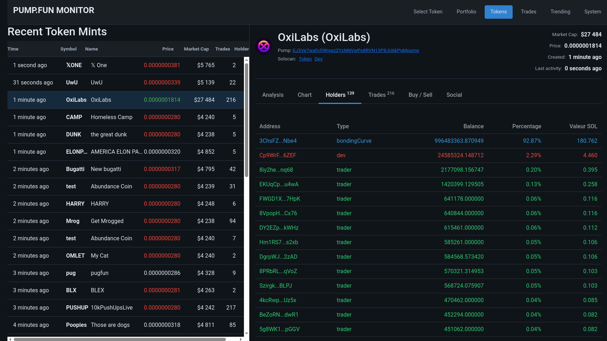
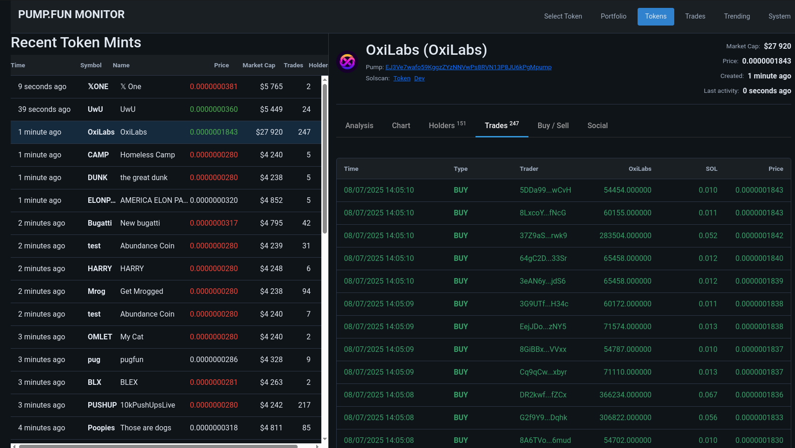
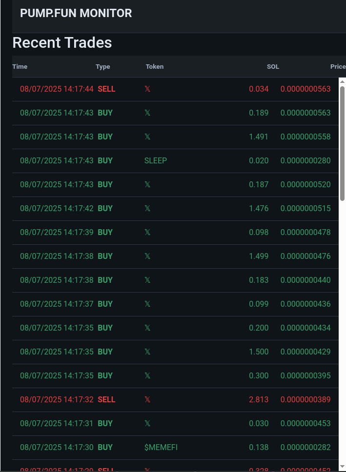
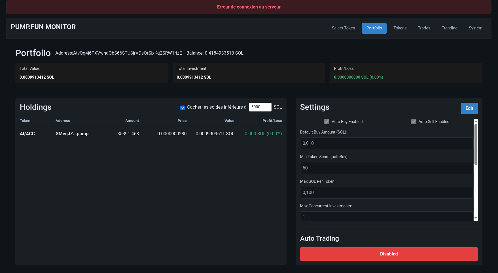

# pump-monitor

**pump-monitor** is a real-time monitoring app for tokens minted on [pump.fun](https://pump.fun).

It consists of:
- A **backend** (Node.js/TypeScript) that indexes on-chain data and provides both a REST API and real-time updates via `socket.io`.
- A **frontend** (React + Vite.js) that displays newly minted tokens, market trends, trading metrics, and safety/risk analysis.

---

## Features

### Backend
- Real-time tracking of new pump.fun token mints
- Trade and holder analysis (buy/sell ratio, market cap changes, etc.)
- Scoring engine for risk and safety metrics
- REST API to expose indexed data
- `socket.io` events for live frontend updates

### Frontend
- Fast, dashboard-style interface
- Live token list with auto-refresh
- Detailed token pages: price chart, trend analysis, holder breakdown
- Automated trading recommendation (buy / hold / sell)

---

## Tech Stack

- **Backend**: Node.js, TypeScript, Express, socket.io
- **Frontend**: React, Vite.js, socket.io-client, Tailwind CSS
- **Other**: Solana JSON-RPC, pump.fun API, WebSocket

---

## Status

Currently used for personal monitoring and testing strategies on pump.fun tokens.  
Not production-ready. No warranty.

---

## License

MIT

---

## Screenshots & Demo

### Video demo  
📽️ [`pumpmonitor.mp4`](./screenshots/pumpmonitor.mp4)

### Screenshots  
  
  
  
  
  

